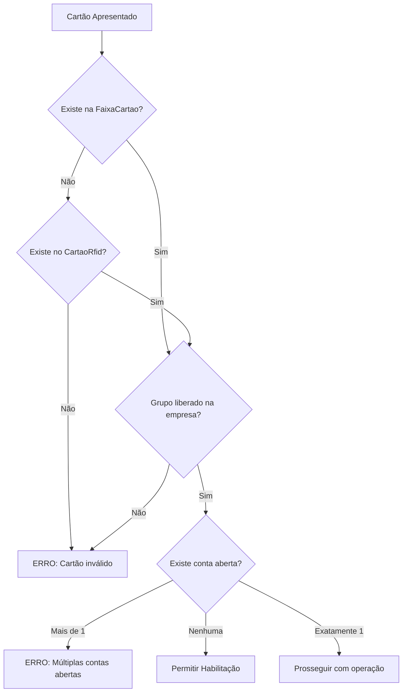
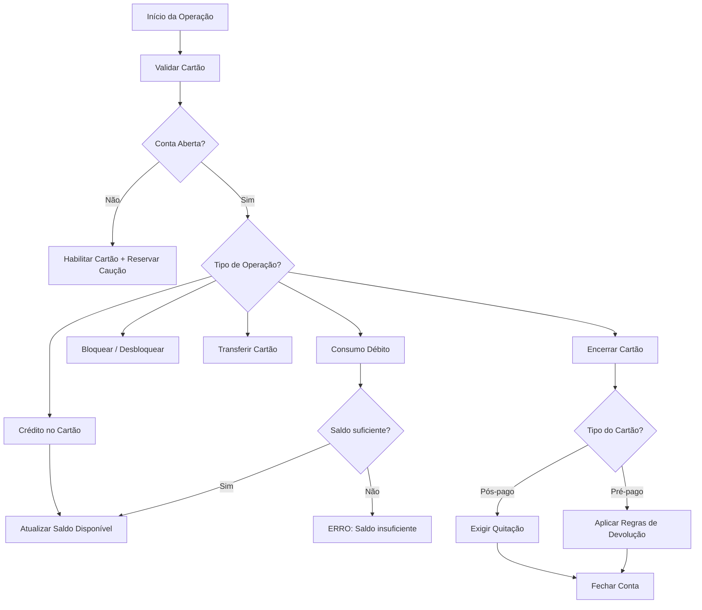
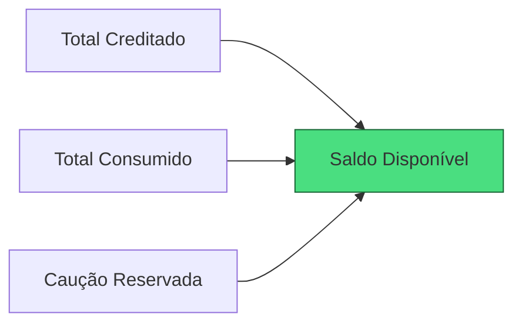

---
tags:
  - backend
  - feature
  - cartoes-internos
  - dominio
  - erp
  - ef-core
relacionado:
  - -[[GrupoCartao]] -[[ContaCartao]] -[[LancamentoConta]] -[[GrupoCartaoEmpresa]] -[[FaixaCartao]] -[[CartaoRfid]]
status: ativo
tipo: feature
versao: 1.2.0
---

# Cartões Internos

Módulo responsável pelo **controle completo de cartões de consumo internos** (Pré-pago e Pós-pago) do ERP Orion. Gerencia desde a validação e habilitação do cartão até créditos, consumos, caução, bloqueios, transferências e encerramento das contas.

## Diagramas

### 1. Fluxo de Validação de Cartão



### 2. Fluxo Completo de Operações



### 3. Cálculo de Saldo



## Como funciona

### Fluxo Principal de Validação de Cartão

Toda operação com cartão inicia com a validação:

1. Verificar se o NumeroCartao pertence a uma **faixa ativa** (FaixaCartao).
2. Ou se o cartão está cadastrado na tabela **CartaoRfid**.
3. Confirmar se o **GrupoCartao** está liberado para a empresa atual (GrupoCartaoEmpresa).
4. Verificar existência de **exatamente uma** conta aberta para esse cartão no tenant:
    - Mais de uma conta aberta → erro de negócio.
    - Nenhuma conta aberta → permite habilitação.

### Principais Operações

**Habilitação do Cartão**

- Valida o cartão conforme regras acima.
- Carrega parâmetros do GrupoCartaoEmpresa da empresa de abertura (caução, limite, descontos, etc.).
- Cria o aggregate ContaCartao + registro de abertura.
- Reserva automaticamente o valor da **caução**.

**Crédito no Cartão**

- Valida cartão e conta aberta.
- Registra LancamentoConta do tipo Credito.
- Atualiza saldo disponível.
- Registra recebimento no caixa com ExternalId.

**Consumo (Débito)**

- Valida cartão e conta aberta.
- Registra LancamentoConta do tipo DebitoConsumo.
- **Pré-pago**: só permite se saldo disponível for suficiente.
- **Pós-pago**: permite até o limite configurado.

**Saldo Disponível**


```
SaldoDisponivel = TotalCreditado - TotalConsumido - CaucaoReservada
```

**Bloqueio / Desbloqueio, Transferência e Encerramento** seguem as regras definidas nos diagramas acima.

## Regras de Negócio (obrigatórias)

- Apenas **uma conta aberta** por cartão por tenant.
- Caução é **sempre reservada** e não pode ser consumida acidentalmente.
- Cartões **Pré-pago**: consumo limitado ao saldo creditado.
- Cartões **Pós-pago**: consumo permitido até o limite; exige recarga ao atingir o limite.
- Toda operação financeira deve ser **idempotente** via ExternalId.
- Controle de concorrência via coluna Version em todas as entidades do aggregate.
- Transferência só permitida dentro do mesmo GrupoCartao.
- Devoluções respeitam limites e políticas definidas em ParamEmpresa.

## Arquivos Principais (novo modelo .NET)

**Domain**

- Domain/Cartoes/ContaCartao.cs (Aggregate Root)
- Domain/Cartoes/GrupoCartao.cs
- Domain/Cartoes/GrupoCartaoEmpresa.cs
- Domain/Cartoes/FaixaCartao.cs
- Domain/Cartoes/LancamentoConta.cs
- Domain/Cartoes/Enums/TipoCartao.cs
- Domain/Cartoes/Enums/CategoriaCartao.cs

**Services**

- Domain/Services/ValidadorCartaoService.cs
- Domain/Services/HabilitacaoCartaoService.cs
- Domain/Services/CreditoCartaoService.cs
- Domain/Services/ConsumoCartaoService.cs
- Domain/Services/EncerramentoCartaoService.cs
- Domain/Services/TransferenciaCartaoService.cs

**Infrastructure**

- Infrastructure/Persistence/Configurations/ContaCartaoConfiguration.cs
- Infrastructure/Persistence/Configurations/LancamentoContaConfiguration.cs

**Application**

- Application/Commands/Cartoes/* (MediatR)

## Integrações

- **Módulo de Caixa**
- **PDV / Frente de Loja** (validação em tempo real)
- **ParamEmpresa**
- **Multi-Tenant**
- **Auditoria**

## Configuração

- Parâmetros operacionais definidos em GrupoCartao e GrupoCartaoEmpresa.
- Faixas de numeração em FaixaCartao.
- Cartões avulsos via CartaoRfid.

## Observações importantes

- O **Aggregate ContaCartao** é o centro do domínio. Todas as regras devem ser validadas internamente.
- A validação de cartão é um ponto crítico de performance — recomenda-se índices compostos e cache Redis.
- Qualquer alteração nas regras de saldo ou caução deve passar por revisão do domínio.

**Esta documentação reflete o comportamento atual do módulo Cartões Internos no novo modelo C# + Entity Framework Core.**