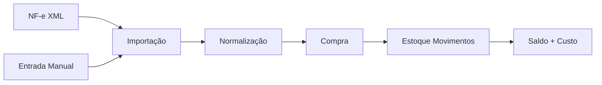
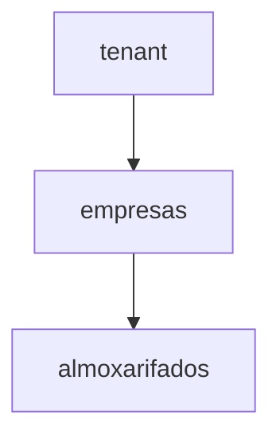
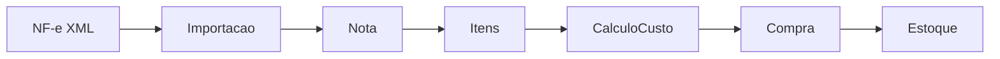
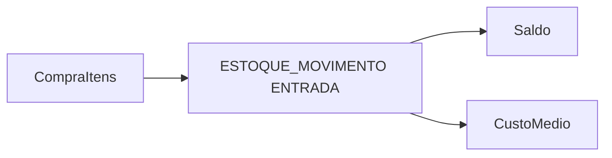

# 📦 Domínio de Estoque + Compras (NF-e / Manual) — OrionERP

---

## 🧠 Visão Geral

Este documento define a modelagem completa do domínio de **estoque, custos e entrada de compras**, suportando:

- entrada via **NF-e (XML)**
- entrada **manual (sem NF-e)**

Ambos seguem o **mesmo pipeline interno**, garantindo consistência total.

---

# 🏗️ Arquitetura Geral



---

# 🧱 Hierarquia



---

# 📏 UNIDADE DE MEDIDA (REGRA CRÍTICA)

## 🧠 Princípio

> Toda movimentação de estoque deve estar na **unidade padrão do produto**

---

## 🧱 Modelagem

### produtos
- unidade_padrao_id

### unidades_medida
- id
- sigla (KG, G, UN, CX, ML)
- tipo (MASSA, VOLUME, UNIDADE)

### produto_unidades
- produto_id
- unidade_id
- fator_para_base

---

## ⚙️ Regra de conversão

```
quantidade_base = quantidade_informada * fator_para_base
```

---

## 📊 Exemplos

### Queijo

| unidade | fator |
|--------|------|
| KG     | 1    |
| G      | 0.001|

### Cerveja

| unidade | fator |
|--------|------|
| UN     | 1    |
| CX     | 12   |

---

## 📥 Aplicação no fluxo

### Compra

```
10 CX → 120 UN
```

### Receita

```
200 G → 0.200 KG
```

### Venda

```
3 UN → 3 UN
```

---

## ⚠️ Validações

- unidade deve ser compatível
- fator deve existir
- nunca misturar unidades no estoque

---

# 📦 ESTOQUE

## Movimentos (fonte da verdade)

- quantidade sempre positiva
- tipo define comportamento
- quantidade sempre na unidade padrão

---

# 🛒 ENTRADA DE COMPRA (DUAS ORIGENS)

## 🟢 1. Entrada via NF-e



---

## 🟡 2. Entrada Manual


---

## 🧠 Regra CRÍTICA

> Ambos os fluxos convergem para a mesma estrutura: **compras + compra_itens + estoque_movimentos**

---

# 🧱 Tabelas (resumo)

## compras
- id
- fornecedor_id (opcional manual)
- nfe_id (nullable)
- tipo_origem (NFE, MANUAL)

---

## compra_itens
- produto_variant_id
- quantidade
- custo_unitario_final

---

# 💰 Cálculo de custo

## Regra única

```
custo_final = valor + encargos - descontos
```

### NF-e
- aplica regras fiscais

### Manual
- usuário informa custo direto

---

# 📥 Entrada no estoque



---

# 🍕 VENDA + PRODUÇÃO (RECEITA)


---

# 📊 EXEMPLOS REAIS

---

## 🟢 Exemplo 1 — Compra via NF-e

```text
Produto: Queijo
Qtd: 50 KG
Custo final: 115
```

---

## 🟡 Exemplo 2 — Compra Manual

```text
Produto: Tomate
Qtd: 20 KG
Custo: 5,00
```

---

## 🔄 Exemplo 3 — Transferência

```text
Central → Bar
Qtd: 30
```

---

## 🔴 Exemplo 4 — Venda com Receita

```text
2x Pizza
Consome:
- Farinha 0.6 KG
- Queijo 0.4 KG
- Calabresa 0.3 KG
```

---

## 💰 Exemplo 5 — CMV

```text
CMV = 11.70
```

---

# ⚖️ IMPOSTOS

## Compra

- recuperável → não entra no custo
- não recuperável → entra

## Venda

- nunca entra no CMV

---

# 🚫 Anti-patterns

- duplicar lógica entre NF-e e manual
- atualizar saldo direto
- recalcular custo retroativo
- misturar unidades no estoque

---

# ✅ Boas práticas

- pipeline único
- custo definido antes do estoque
- movimentos como verdade
- conversão sempre antes do movimento

---

# 🎯 Conclusão

Sistema unificado:

- entrada NF-e ou manual
- conversão automática de unidade
- mesmo fluxo interno
- consistência garantida

---

